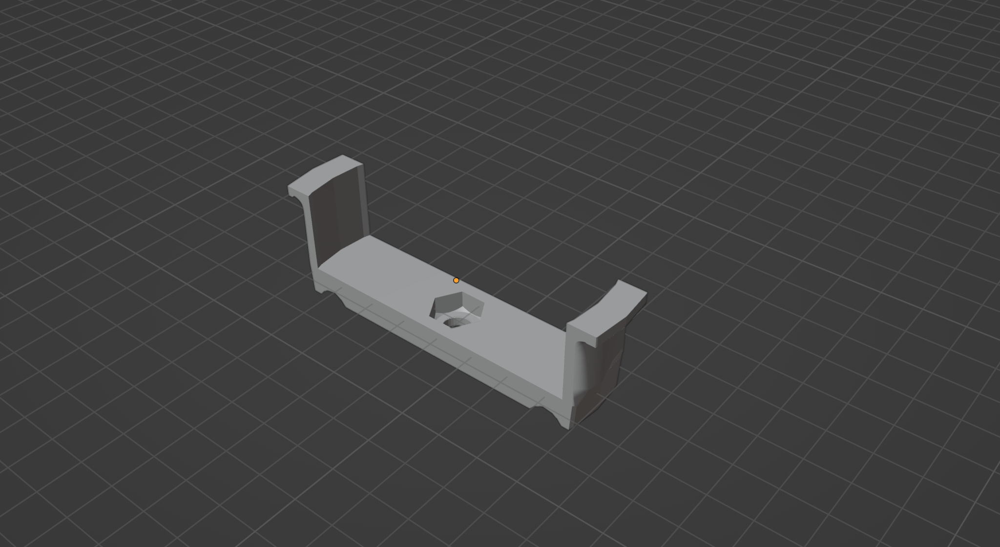
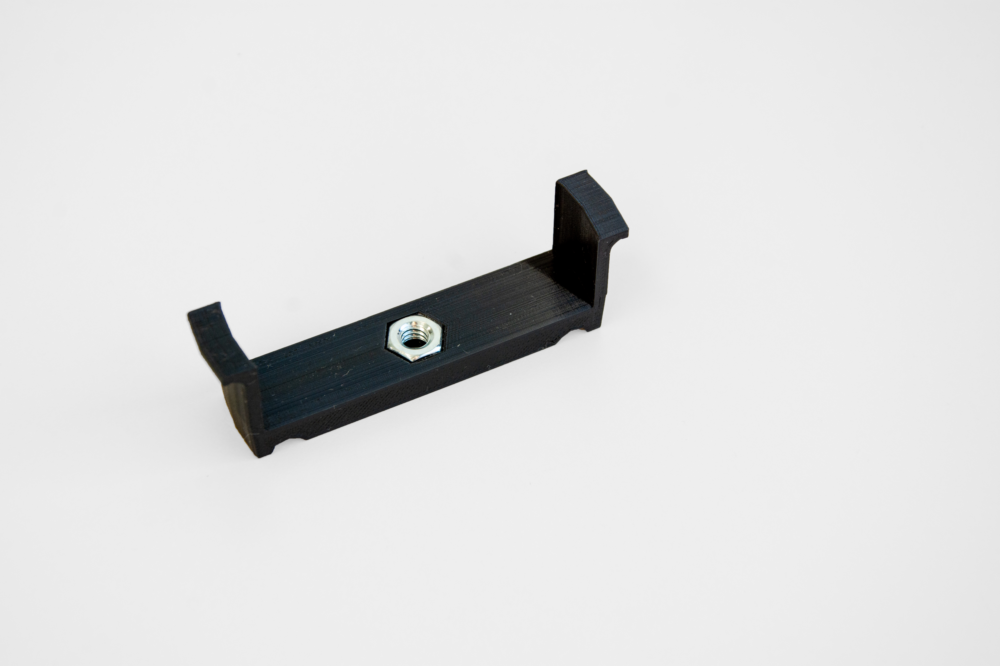
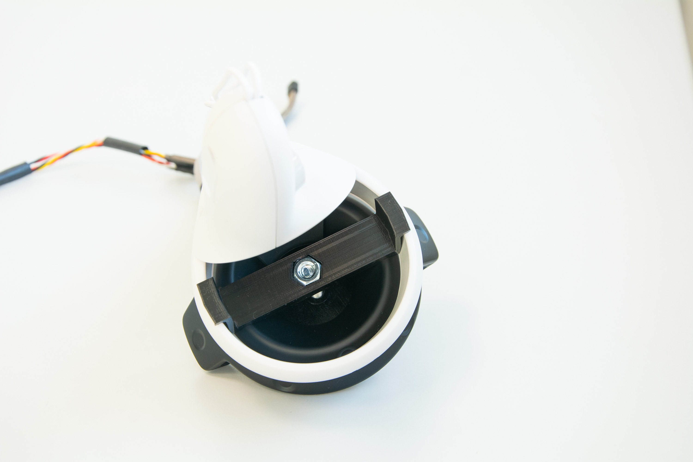

# MetaQuestTouchController2_Mounting
A 3D printed mounting to attach the Meta Quest 2 Touch Controller to an HTC Vive Controller. A whole in the middle accomodates a standardised nut that can be combined with a bolt. The bottom has a small cut out to fit to the top of the HTC Vive controller, however, the bottom can also be easily modified in order to attach other components.

3D Model: https://github.com/CarolinStellmacher/MetaQuestTouchController2_Mounting/blob/main/Mounting.blend

